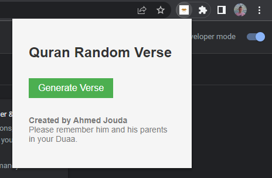
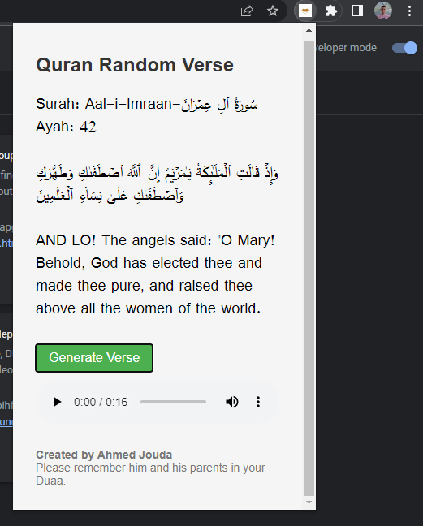

# RandomQuranPlugin
Random Quran Verse generator. With a click of a button you can read a Quranic verse in Arabic and English and listen to the recitation. A good way to break during work sessions and earn reward.

The Quran Random Verse Chrome Extension is a powerful tool that allows you to discover and explore the verses of the Holy Quran. With just a click, you can generate random verses from the Quran, providing you with daily inspiration, guidance, and reflection.

Features:
- Random Verse Generator: Get instant access to a random verse from the Holy Quran at the click of a button. Each verse is meaningful and has a thought-provoking message.
- Multilingual Support: Explore the Quran in different languages. The extension provides verse translations in English, ensuring that you can understand and reflect upon the meaning of the verses.
- Audio Playback: Immerse yourself in the beauty of the recitation by renowned reciters. Listen to the recitation of selected verses in Arabic, bringing the melodious and soul-stirring sounds of the Quran to your ears.
- Experience the beauty and wisdom of the Quran with the Quran Random Verse Chrome Extension. Enhance your spiritual journey, gain valuable insights, and find solace in the timeless words of the Quran.

Screenshots:

## To Use:
### Option 1:
Install it from the Chrome Webstore using   

### Option 2:
1. On Google Chrome go to chrome://extensions/
2. Turn on the toggle for *Developer Mode* in the top right corner.
3. Click *Load Unpacked* in the top left corner and load this folder.
4. The extension is ready to use.
